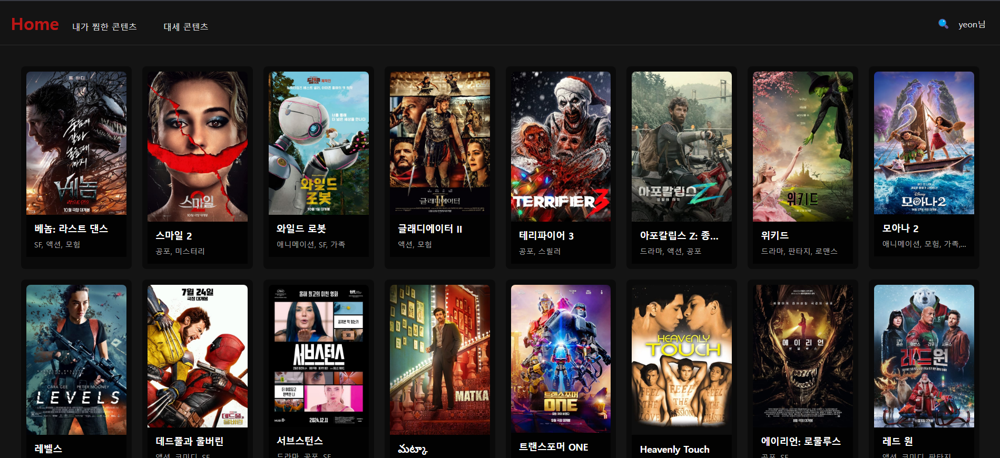

# Movie List Web Application


https://dllxxunhomeflix.netlify.app/

## 프로젝트 개요
넷플릭스 스타일의 영화 목록 웹 애플리케이션입니다.
이 프로젝트는 넷플릭스 스타일의 영화 목록 웹 애플리케이션을 개발하는 것입니다. 사용자는 TMDB API에서 제공하는 다양한 영화 정보를 검색하고 자신만의 위시리스트를 생성 및 관리할 수 있습니다. Vue.js 3와 Composition API를 기반으로 개발했으며,직관적인 UI와 편리한 기능들로 사용자 경험을 극대화하고 있습니다.


## 주요 기능

1. TMDB API를 활용한 영화 정보 검색
: 사용자는 검색창에 영화 제목을 입력하면 TMDB API에서 제공하는 영화 데이터를 가져옵니다. 검색 결과는 영화의 제목, 포스터, 줄거리 등 다양한 정보를 포함합니다.

2. 장르별 영화 필터링
: 사용자는 특정 장르를 선택하여 해당 장르에 속하는 영화만 볼 수 있습니다. 장르 리스트는 TMDB API에서 제공하는 데이터를 기반으로 동적으로 생성됩니다.

3. 평점 기반 영화 정렬
: 사용자는 평점을 기준으로 영화를 정렬할 수 있습니다. 

4. 최근 검색어 저장 기능
: 사용자가 검색한 키워드를 로컬 스토리지에 저장하여 최근 검색어를 표시합니다. 이를 통해 사용자는 이전에 검색했던 내용을 빠르게 다시 검색할 수 있습니다.

5. 위시리스트 관리
: 사용자는 마음에 드는 영화를 위시리스트에 추가하고, 나중에 다시 확인할 수 있도록 관리할 수 있습니다.

6. 무한 스크롤
: 사용자가 스크롤을 내릴 때마다 새로운 영화 데이터를 자동으로 로드합니다. 무한 스크롤을 통해 사용자는 끊김 없이 콘텐츠를 탐색할 수 있습니다.

7. 테이블/그리드 뷰 전환
: 사용자는 테이블 뷰와 그리드 뷰 중 원하는 방식으로 영화 목록을 볼 수 있습니다.


## 기술 스택

- Frontend: Vue.js 3, JavaScript, HTML, CSS
- API: TMDB API
- 상태 관리: Vue Composition API
- 라우팅: Vue Router
- 스타일링: CSS


## 개발 가이드

### 컴포넌트 작성 규칙
- 컴포넌트는 단일 책임 원칙을 따릅니다
- Props와 Emits를 명확히 정의합니다
- Composition API를 사용하여 로직을 구성합니다
### 스타일 가이드
- CSS 클래스명은 BEM 방식을 따릅니다
- 컴포넌트별 스코프드 스타일을 사용합니다
### API 통신
- API 호출은 api 폴더의 모듈을 통해 수행합니다
- 에러 처리를 항상 포함합니다


## 설치 및 실행


```bash
# 저장소 클론
git clone https://github.com/dllxxun/movielist.github.io.git

# 프로젝트 디렉토리 이동
cd <파일 이름>

# 의존성 설치
npm install

# 개발 환경 실행
npm run serve:dev

# 배포 환경 실행
npm run serve:prod

# 개발 환경 빌드
npm run build:dev

# 배포 환경 빌드
npm run build:prod
